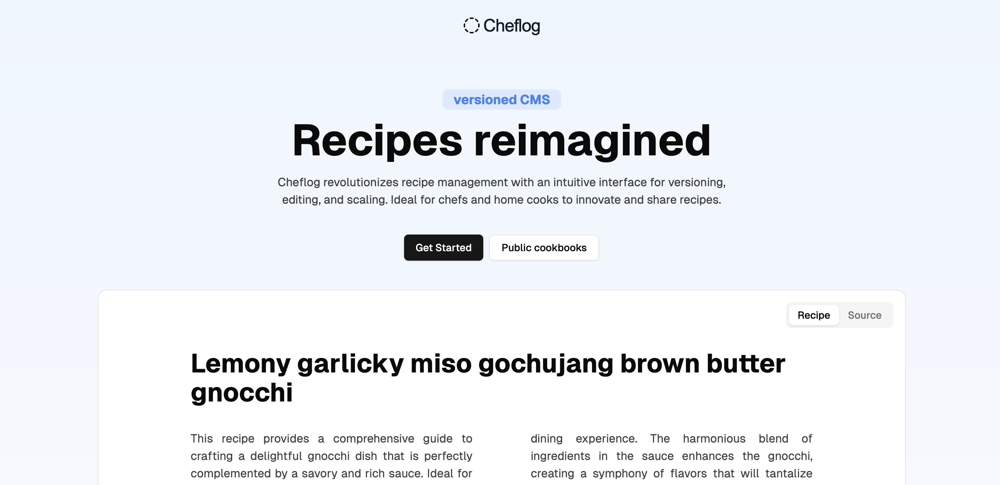

# Cheflog

Cheflog is a language and platform for writing structured, version-controlled recipes. It extends Markdown with a lightweight syntax for ingredients, steps, time, temperature, and more—designed to be both human-readable and machine-parseable. Cheflog includes a smart editor with syntax highlighting, autocompletion, and validation, along with a git-like content management system that tracks changes, supports forking, and allows you to trace the provenance of any recipe. Structured data unlocks features like interactive timers, automatic unit conversions, and scalable portions—all while keeping your source clean and readable.


## Getting Started

```bash
git clone git@github.com:mashnoon33/cheflog.git
cd cheflog
yarn install
cp apps/web/.env.example apps/web/.env
yarn dev
```

The application will be available at `http://localhost:3000`

## Project Structure

```
apps/
├── web/          # Cheflog Next.js spa
packages/
├── ui/           # Shared React component library
├── eslint-config/ # Shared ESLint config
├── typescript-config/ # Shared TypeScript config
├── parser/       # Parser for the Cheflog language
```